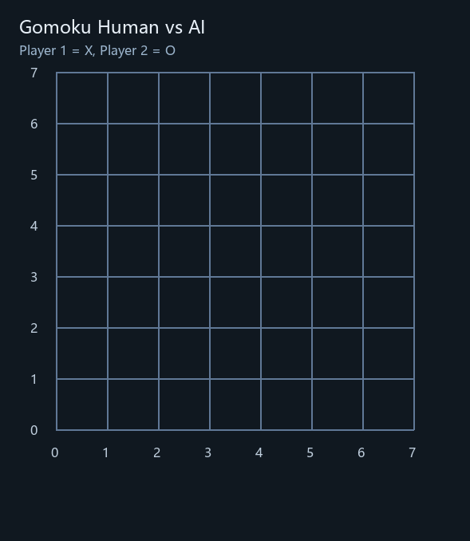

# AlphaZero_Gomoku 课程设计增强版

基于原始 [junxiaosong/AlphaZero_Gomoku](https://github.com/junxiaosong/AlphaZero_Gomoku) 的五子棋 AlphaZero 实现，面向 **Windows + Conda + PyTorch** 环境做了完整适配、自动化脚本封装、课程设计文档补充、实验对比与 PPT 生成。

本仓库当前目标不只是“跑通”，而是把它整理成一套可用于：

- 人机对战演示
- 自博弈训练
- 课程设计撰写
- 实验对比分析
- 课程汇报展示

---

## 首页演示

下面两段 GIF 来自本地 `artifacts/gifs/` 的对局回放，并复制到了仓库 `assets/gifs/` 中用于首页展示。

| 对局回放 A | 对局回放 B |
| --- | --- |
|  |  |

---

## 一、项目功能概览

当前仓库已经支持：

1. 在 Windows + Conda 下直接运行 `human_play.py`
2. 在 Windows + Conda 下直接运行 `train.py`
3. 自动保存人机对战整局 GIF
4. 自动记录训练日志、指标和截图
5. 使用 PyTorch 训练与推理
6. 生成课程设计技术文档
7. 生成实验对比图
8. 自动生成课程汇报 PPTX

---

## 二、快速开始

### 1. 环境准备

建议使用 Conda，Python 版本建议 `3.8 ~ 3.10`。

可参考：

- [environment.windows.yml](environment.windows.yml)
- [requirements.txt](requirements.txt)

安装常用依赖：

```bash
pip install -r requirements.txt
```

如果需要 PyTorch GPU 版本，请根据自己的 CUDA 环境单独安装官方对应版本。

---

## 三、各脚本怎么跑、各自是什么意思

### 1. 人机对战

主脚本：

- [human_play.py](human_play.py)

作用：

- 加载模型与 MCTS 玩家
- 支持 `numpy / pytorch / pure MCTS` 三种后端
- 支持手动输入落子
- 支持从文件读取脚本化走子
- 对局结束后自动保存 GIF

最常用命令：

```bash
python human_play.py --backend numpy --model-file best_policy_8_8_5.model --width 8 --height 8 --n-in-row 5
```

如果使用你自己训练出来的 PyTorch 模型：

```bash
python human_play.py --backend pytorch --model-file artifacts/train_run/best_policy.model --width 6 --height 6 --n-in-row 4
```

手动输入格式：

```text
行,列
```

例如：

```text
2,3
```

也可以用脚本化走子文件：

```bash
python human_play.py --backend numpy --model-file best_policy_8_8_5.model --moves-file demo_human_moves.txt
```

相关辅助脚本：

- [run_human_play_windows.ps1](run_human_play_windows.ps1)：Windows 一键运行人机对战，自动保存日志和终端截图
- [demo_human_moves.txt](demo_human_moves.txt)：示例走子文件

---

### 2. 自博弈训练

主脚本：

- [train.py](train.py)

作用：

- 进行 self-play 数据采集
- 维护经验池
- 调用策略价值网络更新参数
- 定期与 pure MCTS 对弈评估
- 自动保存 `current_policy.model` 与 `best_policy.model`
- 自动记录 `loss / entropy / KL / win_ratio` 等训练指标

最常用命令：

```bash
python train.py --backend pytorch --board-width 6 --board-height 6 --n-in-row 4 --n-playout 64 --batch-size 32 --game-batch-num 100 --check-freq 10 --pure-mcts-playout-num 64 --eval-games 10 --save-dir artifacts/train_run --use-gpu
```

相关辅助脚本：

- [run_train_windows.ps1](run_train_windows.ps1)：Windows 一键训练，自动保存日志和截图
- [run_all_windows.ps1](run_all_windows.ps1)：顺序跑人机对战和训练冒烟测试
- [plot_training_metrics.py](plot_training_metrics.py)：根据 `training_metrics.jsonl` 画训练曲线
- [plot_model_eval_curve.py](plot_model_eval_curve.py)：对已有模型做后验评测，画 `win ratio` 曲线

---

### 3. 课程实验脚本

实验主脚本：

- [run_course_experiments.py](run_course_experiments.py)

作用：

- 自动跑 baseline 与 reward shaping 两组实验
- 自动生成 loss 对比图
- 自动生成 evaluation win ratio 对比图
- 自动生成启发式奖励统计图
- 自动输出实验摘要 JSON

示例命令：

```bash
python run_course_experiments.py --force --tag longer_compare_v1 --board-width 6 --board-height 6 --n-in-row 4 --n-playout 32 --batch-size 32 --buffer-size 5000 --play-batch-size 1 --epochs 5 --check-freq 5 --game-batch-num 30 --pure-mcts-playout-num 64 --eval-games 10 --seed 2026
```

---

### 4. 技术文档与课程 PPT 生成

相关脚本：

- [generate_course_docs.py](generate_course_docs.py)：生成课程设计 Markdown 技术文档
- [main.py](main.py)：自动生成课程汇报 PPTX

示例命令：

```bash
python generate_course_docs.py
python main.py
```

---

## 四、现在的代码框架

### 1. 核心模块结构

```text
AlphaZero_Gomoku
├─ game.py                         # 棋盘、规则、对局流程、自博弈流程
├─ mcts_alphaZero.py              # 带策略价值网络引导的 MCTS
├─ mcts_pure.py                   # 纯 MCTS，对照评估使用
├─ train.py                       # 训练主循环
├─ human_play.py                  # 人机对战入口
├─ heuristic_reward.py            # 启发式奖励 shaping
├─ policy_value_net_pytorch.py    # PyTorch 策略价值网络
├─ policy_value_net_numpy.py      # Numpy 推理模型加载
├─ plot_training_metrics.py       # 训练曲线绘制
├─ plot_model_eval_curve.py       # 模型评测曲线绘制
├─ run_course_experiments.py      # 课程实验自动化
├─ generate_course_docs.py        # 课程文档生成
├─ main.py                        # 课程 PPT 生成
├─ run_human_play_windows.ps1     # Windows 人机对战自动化
├─ run_train_windows.ps1          # Windows 训练自动化
└─ run_all_windows.ps1            # Windows 冒烟联调
```

### 2. 训练主流程

训练主循环位于 [train.py](train.py)，大体流程是：

1. 运行 self-play 采样棋局
2. 对棋局数据做旋转、翻转增强
3. 放入 replay buffer
4. 从 buffer 抽样进行策略价值网络训练
5. 定期与 pure MCTS 对弈评估
6. 记录指标并保存模型

### 3. AlphaZero 在本项目中的实现关系

- `game.py`：负责环境和对局推进
- `mcts_alphaZero.py`：负责搜索
- `policy_value_net_pytorch.py`：负责策略概率与局面价值预测
- `train.py`：把 self-play、训练和评估串起来

---

## 五、课程设计结合点

本仓库在原始项目基础上，重点补了适合作为课程设计展示的内容。

### 1. 课程设计主题

题目可直接使用：

**《基于 AlphaZero 与蒙特卡洛树搜索的五子棋 AI 设计》**

### 2. 本次课程设计做了哪些增强

#### Windows 工程化适配

- 修复了 Windows 下运行细节
- 补充了 Conda 自动化脚本
- 自动输出日志和截图

#### PyTorch 兼容修复

- 适配新版本 PyTorch 的 API
- 支持直接训练与加载模型

#### 创新点：启发式奖励 Reward Shaping

新增文件：

- [heuristic_reward.py](heuristic_reward.py)

训练时可选启用：

- 活三
- 活四
- 连五

实现思路：

- 在 self-play 中对每步落子后的局面进行模式统计
- 将启发式局面奖励叠加到原始终局 `z` 标签上
- 形成更细粒度的 value target

#### 实验分析自动化

- 自动对比 baseline 与 reward shaping
- 自动绘制 loss 曲线
- 自动绘制 win ratio 曲线
- 自动生成课程文档与 PPT

---

## 六、训练参数怎么理解

这几个参数最容易混：

- `n_playout`：每一步落子前，MCTS 搜索模拟多少次
- `play_batch_size`：每轮训练循环采集多少局 self-play
- `game_batch_num`：训练主循环总共跑多少轮

因此总 self-play 局数近似为：

```text
play_batch_size × game_batch_num
```

例如：

```text
play_batch_size = 1
game_batch_num = 30
```

表示大约 self-play `30` 局。

---

## 七、常见运行命令整理

### 1. 运行仓库自带 8x8 模型做人机对战

```bash
python human_play.py --backend numpy --model-file best_policy_8_8_5.model --width 8 --height 8 --n-in-row 5
```

### 2. 用 PyTorch 模型做人机对战

```bash
python human_play.py --backend pytorch --model-file artifacts/train_run/best_policy.model --width 6 --height 6 --n-in-row 4
```

### 3. 跑一个轻量训练样例

```bash
python train.py --backend pytorch --board-width 6 --board-height 6 --n-in-row 4 --n-playout 64 --batch-size 32 --game-batch-num 100 --check-freq 10 --pure-mcts-playout-num 64 --eval-games 10 --save-dir artifacts/train_run --use-gpu
```

### 4. 画训练曲线

```bash
python plot_training_metrics.py --run-dir artifacts/train_run
```

### 5. 评测已有模型并绘制 win ratio 曲线

```bash
python plot_model_eval_curve.py --model-file best_policy_8_8_5.model --backend numpy --width 8 --height 8 --n-in-row 5 --ai-playout 200 --eval-games 2 --pure-playouts 16 32 64 --output-dir artifacts/model_eval/best_policy_8_8_5_quick
```

### 6. 生成课程文档与 PPT

```bash
python generate_course_docs.py
python main.py
```

---

## 八、当前已生成的课程设计资料

### 文档

- [docs/AlphaZero_Gomoku_技术文档.md](docs/AlphaZero_Gomoku_%E6%8A%80%E6%9C%AF%E6%96%87%E6%A1%A3.md)

### 图像资源

- `assets/architecture_diagram.png`
- `assets/alpha_zero_workflow.png`
- `assets/module_relationship.png`
- `assets/mcts_tree.png`
- `assets/experiment_loss.png`
- `assets/experiment_win_ratio.png`
- `assets/longer_compare_v1_loss.png`
- `assets/longer_compare_v1_win_ratio.png`

### 本地生成但默认不上传的大目录

以下目录在本地实验时会持续更新，但默认不纳入版本管理：

- `artifacts/`
- `course_outputs/`
- `.matplotlib/`
- `.vendor/`

---

## 九、已做的关键改动

相比原始仓库，这一版主要新增或修改了：

- [human_play.py](human_play.py)：支持 GIF 自动保存、脚本化输入、PyTorch 模型加载
- [game.py](game.py)：支持 recorder 和 reward shaping self-play
- [train.py](train.py)：支持 PyTorch 默认训练、reward shaping 参数、训练指标记录
- [policy_value_net_pytorch.py](policy_value_net_pytorch.py)：适配新版本 PyTorch
- [heuristic_reward.py](heuristic_reward.py)：启发式奖励模块

---

## 十、说明

1. 原仓库自带的 `best_policy_8_8_5.model` 是 Theano/Lasagne 风格参数，运行人机对战时应配合：

```bash
--backend numpy
```

2. 使用本仓库训练得到的 `best_policy.model` / `current_policy.model` 时，应配合：

```bash
--backend pytorch
```

3. 如果要在 GitHub 页面展示本地生成 GIF，必须把 GIF 放在受版本控制的目录下，因此这里使用了 `assets/gifs/`。

---

## 十一、参考资料

- 原始项目：[junxiaosong/AlphaZero_Gomoku](https://github.com/junxiaosong/AlphaZero_Gomoku)
- AlphaZero: Mastering Chess and Shogi by Self-Play with a General Reinforcement Learning Algorithm
- AlphaGo Zero: Mastering the Game of Go without Human Knowledge

