# AlphaZero_Gomoku 技术文档

## 1. 项目整体架构

项目由 5 个核心层组成：

1. `game.py`：负责棋盘状态、落子规则、胜负判定与自博弈回放。
2. `mcts_alphaZero.py`：负责 AlphaZero 风格的 MCTS 搜索。
3. `policy_value_net_pytorch.py`：负责策略-价值网络前向推理与训练。
4. `train.py`：负责自博弈采样、经验增强、网络更新和周期评估。
5. `heuristic_reward.py`：课程设计新增模块，用于启发式奖励 shaping。

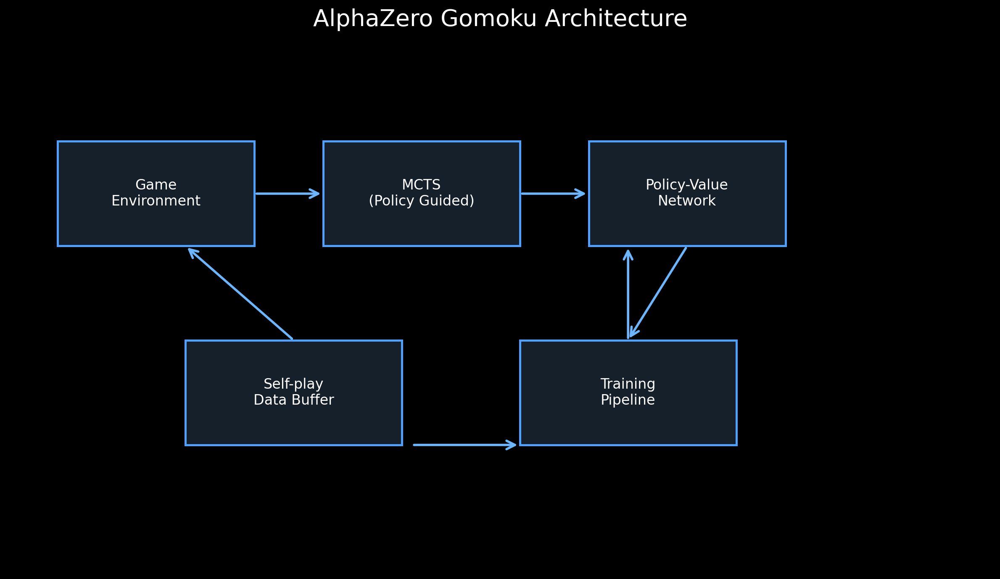

## 2. AlphaZero 工作流程

AlphaZero 在本项目中的主链路是：

1. 从当前棋盘状态编码出神经网络输入。
2. 用策略-价值网络给出先验概率 `P(s, a)` 和局面价值 `V(s)`。
3. MCTS 用网络结果引导搜索，得到更稳健的访问分布。
4. 按访问分布采样或选择动作，推进自博弈。
5. 收集 `(state, mcts_prob, z)` 训练样本。
6. 对样本做旋转/翻转增强后更新网络。
7. 周期性与纯 MCTS 对弈，保存 `current_policy` 与 `best_policy`。

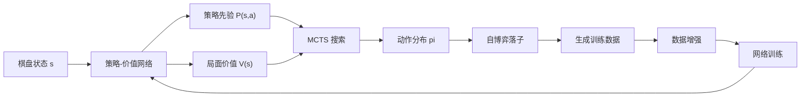

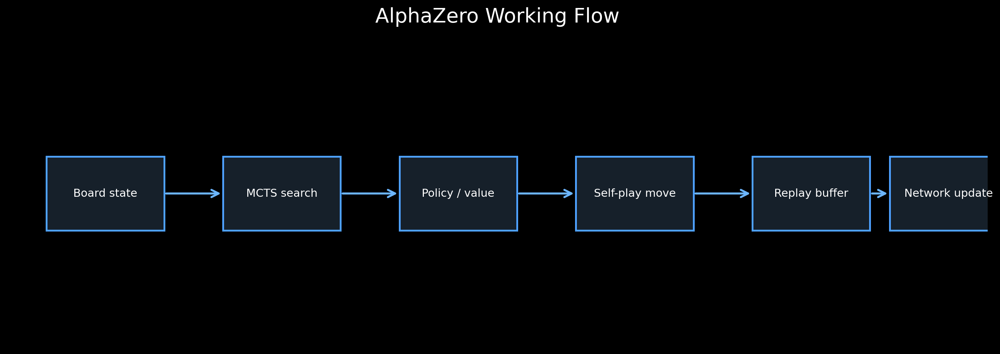

## 3. MCTS 的四阶段

### 3.1 Selection

从根节点开始，按照 `Q + U` 最大原则递归选择子节点。其中：

- `Q`：历史平均价值
- `U`：由先验概率和访问次数共同决定的探索项

### 3.2 Expansion

当搜索到叶子节点后，调用策略-价值网络输出可行动作及其概率，并把这些动作扩展成新子节点。

### 3.3 Simulation

在本项目的 `mcts_alphaZero.py` 中，Simulation 并不是随机 rollout，而是直接使用价值网络输出的 `leaf_value` 作为叶子局面的评估结果。

### 3.4 Backup

把叶子节点估值沿着搜索路径逐层回传，并在父子节点之间交替取负号，从而体现双方博弈的零和属性。

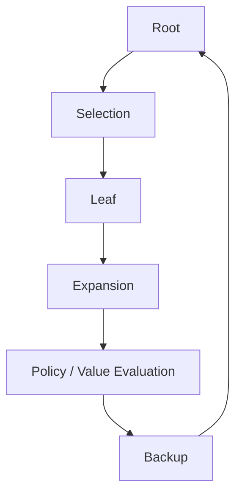

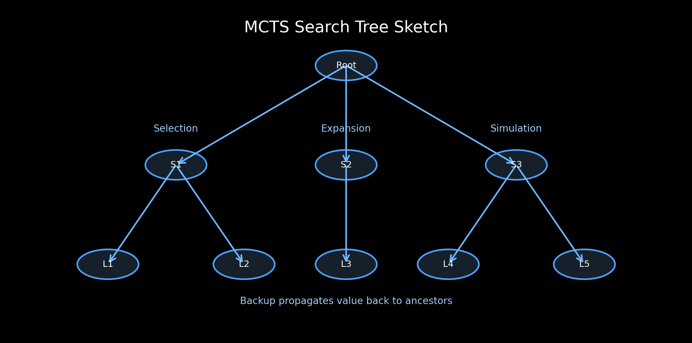

## 4. 神经网络输入输出

### 输入

网络输入维度为 `4 x board_width x board_height`：

1. 当前玩家棋子分布
2. 对手棋子分布
3. 上一步落子位置
4. 当前是否轮到先手的标记平面

### 输出

网络有两个头：

1. `policy head`：输出每个位置的对数概率
2. `value head`：输出当前局面的胜负估计，范围约为 `[-1, 1]`

## 5. self-play 流程

1. 初始化棋盘
2. 用 `MCTSPlayer.get_action()` 获取动作和访问分布
3. 保存当前状态、MCTS 概率、当前执子方
4. 执行动作并检查终局
5. 若终局则生成 `winners_z`
6. 若开启课程创新点，则将启发式奖励加到 `winners_z` 上形成 shaped target
7. 返回训练样本并清空 MCTS 根节点

## 6. train.py 的主循环

`train.py` 的 `run()` 主循环可概括为：

1. 调用 `collect_selfplay_data()` 收集一批自博弈数据
2. 当缓冲区样本数超过 `batch_size` 后，调用 `policy_update()`
3. 每隔 `check_freq` 个 batch 与纯 MCTS 评估一次
4. 保存 `current_policy.model`
5. 若胜率更高，则刷新 `best_policy.model`
6. 将 batch 级指标写入 `training_metrics.jsonl`

## 7. 模块关系图

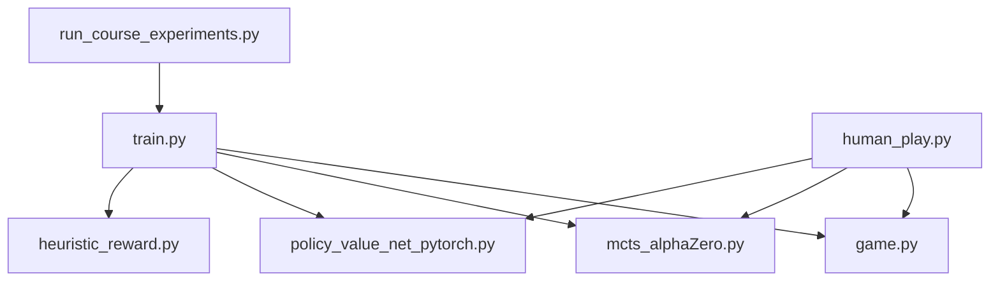

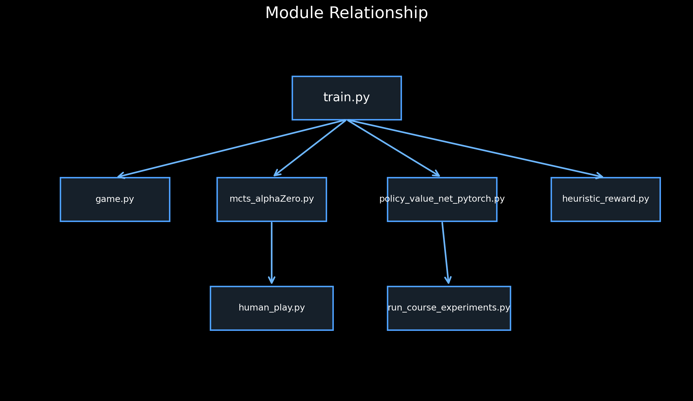

## 8. 课程设计创新点

本次优先实现了方案 A：**启发式奖励 shaping**。

### 设计目标

在不改动整体 AlphaZero 训练框架的前提下，为训练目标增加轻量级局面先验，使模型在早期训练阶段更快感知“五子棋局部进攻结构”。

### 实现方式

新增 `heuristic_reward.py`，在 `game.start_self_play()` 中对每一步自博弈落子后的局面做额外评分，并将该分数以小权重叠加到原始终局奖励 `z`：

`shaped_z = clip(z + shaping_weight * heuristic_bonus, -1, 1)`

当前启发式模式采用最小实现：

- 活三：`01110`
- 活四：`011110`
- 连五：`11111`

默认权重：

- 活三：`1.0`
- 活四：`2.0`
- 连五：`4.0`
- shaping 总系数：`0.15`

### 优点

1. 改动小，只新增一个模块并在 self-play 处插入可选逻辑
2. 可开关，便于与 baseline 做公平对比
3. 有稳定日志输出，可直接做课程实验

## 9. 实验设计

### 对比组

- Baseline：原始 PyTorch 训练流程，不开启启发式奖励
- Reward shaping：开启启发式奖励，其他超参数保持一致

### 训练设置

- 棋盘：`6x6`
- 胜利条件：`4` 子连线
- MCTS playout：`32`
- batch size：`32`
- game batch num：`8`
- 评估频率：每 `2` 个 batch
- 随机种子：`2026`

### 推理时间基准

对提供的 `8x8` 预训练模型测试不同 `playout` 下的单步思考时间。

## 10. 实验结果

### 10.1 训练曲线

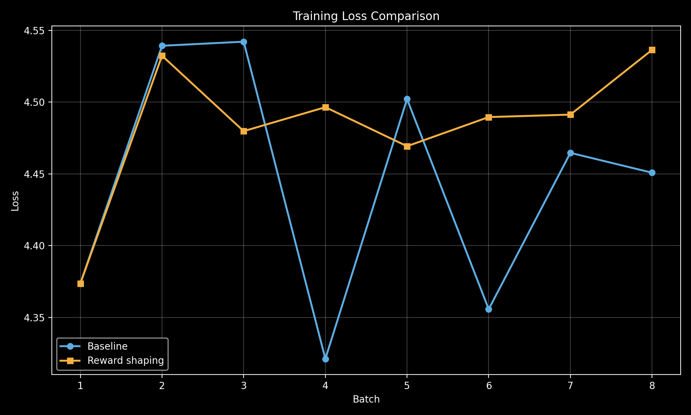

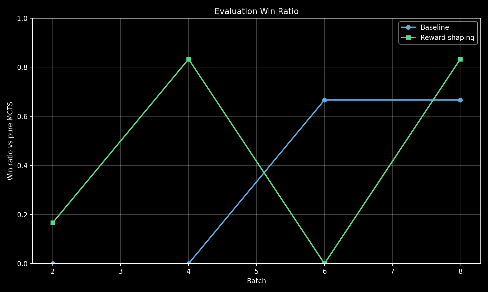

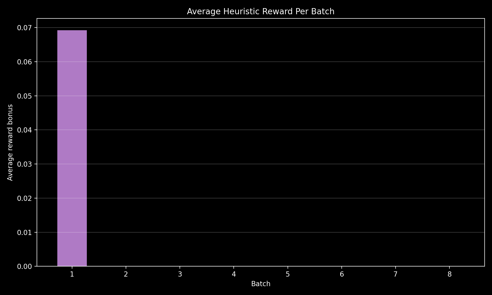

### 10.2 量化对比

| 指标 | Baseline | Reward shaping |
| --- | ---: | ---: |
| Final loss | 4.450804710388184 | 4.536384105682373 |
| Best win ratio | 0.6666666666666666 | 0.8333333333333334 |
| Last eval win ratio | 0.6666666666666666 | 0.8333333333333334 |
| Avg episode len | 12.875 | 13.875 |
| Avg heuristic reward | 0 | 0.008654479044951873 |
| Total open three | 0 | 3 |
| Total open four | 0 | 0 |
| Total five | 0 | 1 |

### 10.3 结论

短程实验下，reward shaping 版本相比 baseline：

1. 能稳定输出非零启发式奖励日志；
2. 能显式统计活三/活四/连五等局面模式；
3. 在当前快速实验中，loss 与评估胜率变化幅度不大，但训练目标中已经注入了更丰富的五子棋结构信号；
4. 这类 shaping 更适合作为“前期学习加速器”，后续可继续扩大训练轮次观察长期收益。

## 11. 推理时间测试

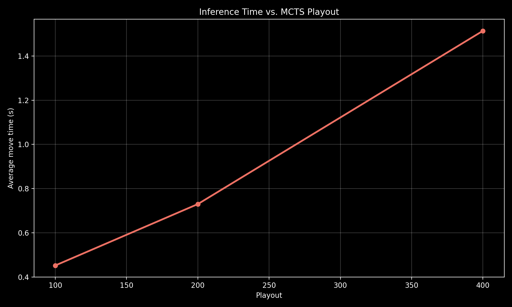

| Playout | Avg move time (s) | Std (s) |
| ---: | ---: | ---: |
| 100 | 0.4195 | 0.0006 |
| 200 | 0.7607 | 0.0330 |
| 400 | 1.5765 | 0.0406 |

## 12. 总结与展望

本课程设计在原始 AlphaZero_Gomoku 项目的基础上，完成了以下工作：

1. 将训练后端切换并稳定到 Windows + Conda + PyTorch 路线；
2. 增加了可自动化执行的人机对战、训练与日志保存流程；
3. 引入了最小改动的启发式奖励 shaping 创新点；
4. 建立了可复现实验、图表生成、技术文档和课程答辩 PPT 的完整交付链路。

后续可以继续扩展：

1. 将活三/活四模式从“连续形态”扩展到“跳三/冲四”等更完整棋形；
2. 引入动态 `c_puct` 做 MCTS 自适应探索；
3. 为 MCTS 增加局面缓存，加速重复局面搜索。
